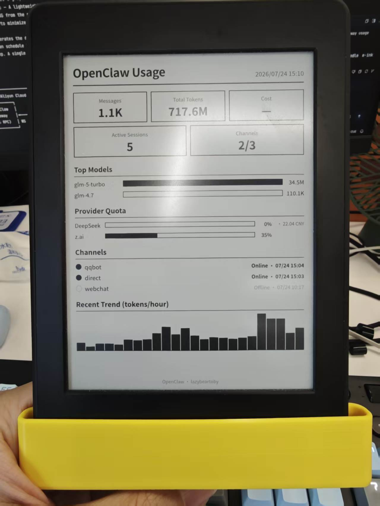
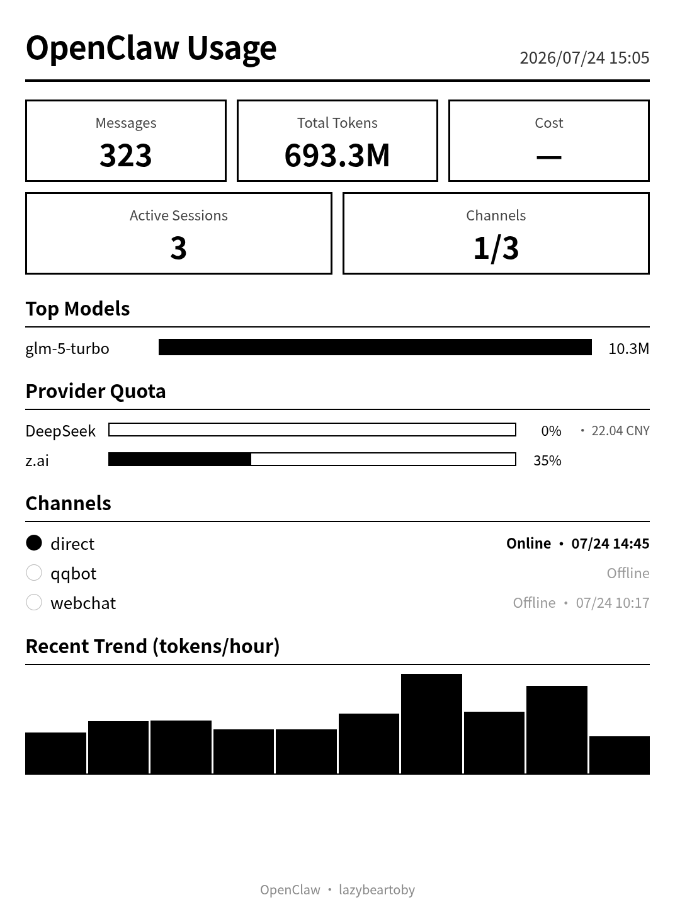

# Kindle OpenClaw 仪表盘

把旧 Kindle 变成一个低功耗仪表盘，实时展示你自托管的 [OpenClaw](https://github.com/openclaw/openclaw) AI 网关的用量数据。

[English](./README.md)



## 仪表盘效果



## 项目简介

本项目将 Kindle Paperwhite（或其他越狱过的 Kindle 型号）变成一个常亮、超低功耗的仪表盘。默认仪表盘可视化自托管 OpenClaw 网关的用量数据，同时提供可插拔的模板系统，你可以展示任何内容 —— 第二个内置模板展示当月日历（含农历和节假日）、实时天气和今天的 Notion 待办。通过 Web 管理面板可以在浏览器中切换模板并配置所有参数。

项目由两部分组成：

1. **后端服务** (`server/`) — Node.js 服务，部署在 OpenClaw 所在的服务器上。通过 WebSocket RPC 连接到 OpenClaw 网关（或为第二个模板获取天气/待办数据），渲染适合 e-ink 屏幕的 HTML 仪表盘，并截图生成与 Kindle 屏幕分辨率匹配的灰度 PNG 图片。Web 管理面板（用户名密码保护）允许在浏览器中切换模板并配置连接参数。
2. **Kindle 客户端** (`src/`) — 运行在 Kindle 上的轻量 Shell 脚本。周期性从后端拉取最新的 PNG 图片，显示在 e-ink 屏幕上，并在两次刷新之间将设备挂起到内存（suspend to RAM）以最大限度省电。

后端按计划（默认每 5 分钟）预生成仪表盘图片；Kindle 按自己的计划（默认每 10 分钟）唤醒、拉取新图片、显示、再休眠。一次充电可使用数周。

## 架构

```
┌──────────────────────────────────────────────────────┐
│                  阿里云服务器                        │
│  ┌─────────────┐      ┌──────────────────────────┐   │
│  │  OpenClaw   │      │  kindle-dash 后端服务    │   │
│  │  Gateway    │◄────►│  (Node.js)               │   │
│  │  (WS RPC)   │ WS   │                          │   │
│  └─────────────┘      │  模板系统：              │   │
│                       │  • openclaw (WS RPC)     │   │
│  ┌─────────────┐      │  • calendar-weather-todo │   │
│  │  wttr.in /  │─────►│    (wttr.in + Notion)    │   │
│  │  Notion API │      │                          │   │
│  └─────────────┘      │  • 渲染 HTML             │   │
│                       │  • 截图生成 PNG          │   │
│                       │  • 提供 /dash.png        │   │
│                       │  • 管理面板 (/admin)     │   │
│                       └────────┬─────────────────┘   │
└────────────────────────────────┼─────────────────────┘
                                 │ HTTP
                    ┌────────────┼────────────┐
                    ▼                         ▼
┌──────────────────────────┐    ┌─────────────────────────┐
│    Kindle Paperwhite     │    │   浏览器（管理面板）    │
│  ┌────────────────────┐  │    │  ┌───────────────────┐  │
│  │  dash.sh           │  │    │  │  /admin           │  │
│  │  • 通过 RTC 唤醒   │  │    │  │  • 登录           │  │
│  │  • 拉取 dash.png   │  │    │  │  • 切换模板       │  │
│  │  • eips 显示       │  │    │  │  • 编辑配置       │  │
│  │  • 挂起到内存      │  │    │  │  • 测试 & 生成    │  │
│  └────────────────────┘  │    │  └───────────────────┘  │
└──────────────────────────┘    └─────────────────────────┘
```

## 功能特性

- **多仪表盘模板** — 在管理面板中切换不同仪表盘：
  - **OpenClaw 用量**（默认）— Token 用量、消息数、活跃会话、热门模型、Provider 配额（DeepSeek 余额、z.ai 用量窗口）、渠道状态（WebChat、Telegram、QQ Bot 等）
  - **日历 / 天气 / 待办** — 当月日历（含农历和中国节假日）、来自 [wttr.in](https://wttr.in) 的实时天气、从 Notion 数据库拉取的今日待办
- **Web 管理面板** — 用户名密码验证保护（基于 express-session）；可在浏览器中切换模板、配置 OpenClaw 连接、天气城市和 Notion 凭证、测试数据获取、手动触发生成
- **响应式管理界面** — 桌面端左右两栏布局，移动端/平板自动切换为单列；包含当前模板状态卡片（显示下次刷新时间）、未保存修改提示、全屏加载遮罩和详细的 Toast 通知
- **模板系统** — 可插拔架构；每个模板实现 `fetchData()` + `render()` 两个方法。在 `server/src/templates/` 下添加文件即可扩展
- **可配置的 OpenClaw 连接** — 网关地址、认证方式（`password` / `token` / `none`）、凭证都可在管理面板配置（存储于 `data/settings.json`）；环境变量作为默认值/回退
- **E-ink 优化渲染** — 纯黑白、高对比度、无抗锯齿、CSS 条形图，针对 Kindle Paperwhite 第 7 代（1072×1448 竖屏）调优
- **WebSocket RPC** — 直连 OpenClaw 网关 WebSocket，支持 `token` 和 `password` 两种认证模式；并行调用 `sessions.usage` 和 `usage.status` RPC 方法
- **超低功耗** — Kindle 在两次刷新之间挂起到内存；一次充电可用数周
- **RTC 唤醒** — 自动检测不同 Kindle 型号的 RTC 路径，确保按计划可靠唤醒
- **Docker 部署** — 通过 `docker compose up -d --build` 一键部署；使用 `network_mode: host` 网络模式，容器可直接通过 localhost 访问 OpenClaw
- **可配置计划** — 后端每 5 分钟生成新图片（cron）；Kindle 每 10 分钟刷新一次（可配置）
- **灰度转换** — PNG 转为纯灰度（无 alpha 通道），确保 e-ink 显示清晰
- **调试端点** — `GET /debug` 返回标准化后的 JSON 数据；`GET /api/test/:templateId` 测试任意模板的数据获取

## 前置条件

### 服务端
- 一台运行 OpenClaw 网关的服务器（使用 `password` 或 `token` 认证模式）
- 已安装 Docker 和 Docker Compose

### Kindle 端
- 一台已越狱的 Kindle，已配置 Wi-Fi
- 通过 [USBNetwork](https://wiki.mobileread.com/wiki/USBNetwork) 配置 SSH 访问
- 已在 Kindle Paperwhite 第 7 代上测试；其他越狱过的 Kindle 型号经少量修改也应可用

## 后端服务部署

### 1. 配置

```sh
cd server
cp .env.example .env
vi .env
```

`.env` 中的关键配置：

| 变量 | 默认值 | 说明 |
|---|---|---|
| `OPENCLAW_BASE_URL` | `http://127.0.0.1:18789` | OpenClaw 网关地址（当后端与 OpenClaw 同机部署且使用 `network_mode: host` 时用 `127.0.0.1`） |
| `OPENCLAW_AUTH_MODE` | `password` | 认证方式：`password` / `token` / `none`。可在管理面板覆盖 |
| `OPENCLAW_CREDENTIAL` | — | 你的 OpenClaw 网关密码或 token。可在管理面板覆盖 |
| `FETCH_MODE` | `api` | `api` = 通过 WS 连接 OpenClaw；`mock` = 使用模拟数据（用于测试） |
| `PORT` | `3000` | HTTP 服务端口 |
| `OUTPUT_FILE` | `public/dash.png` | 生成的 PNG 输出路径 |
| `GENERATE_CRON` | `*/5 * * * *` | 图片生成的 cron 计划 |
| `SCREEN_WIDTH` | `1072` | Kindle 屏幕宽度（竖屏） |
| `SCREEN_HEIGHT` | `1448` | Kindle 屏幕高度（竖屏） |
| `PAGE_RENDER_DELAY` | `1000` | 页面加载后额外等待的毫秒数，确保字体/布局渲染完成后再截图 |
| `ADMIN_USERNAME` | `admin` | 管理面板用户名 |
| `ADMIN_PASSWORD` | `admin` | 管理面板密码（**请务必修改！**） |
| `SESSION_SECRET` | `change-me-...` | Session cookie 加密密钥（**请务必修改！**） |

> 说明：OpenClaw 连接配置（`baseUrl`、`authMode`、`credential`）和模板特定配置（天气城市、Notion API key/DB ID）在通过管理面板配置后会存储在 `data/settings.json` 中。环境变量作为默认值/回退。

### 2. 部署

```sh
# 准备 public 和 data 目录权限（UID 1000 对应容器内的 node 用户）
mkdir -p ./public ./data && chown -R 1000:1000 ./public ./data

# 构建并启动
docker compose up -d --build
```

### 3. 验证

```sh
# 查看日志
docker compose logs -f

# 查看标准化后的数据（不生成图片）
curl http://localhost:3000/debug | python3 -m json.tool

# 手动触发生成图片
curl -X POST http://localhost:3000/generate

# 下载生成的图片
curl http://localhost:3000/dash.png -o test.png
```

### 4. 通过管理面板配置

在浏览器中打开 `http://你的服务器IP:3000/admin`，使用 `.env` 中的 `ADMIN_USERNAME` / `ADMIN_PASSWORD` 登录。

管理面板采用响应式左右两栏布局：

- **左栏** — 当前模板状态卡片（显示模板名称、描述、ID 和下次定时刷新时间）+ 模板选择器
- **右栏** — 当前模板的配置表单 + 数据获取测试结果面板

在管理面板中可以：

- **切换仪表盘模板** — 在 OpenClaw 用量 和 日历/天气/待办 之间切换
- **配置 OpenClaw 连接** — 设置网关地址、认证方式（`password` / `token` / `none`）和凭证
- **配置天气城市** — 为日历/天气/待办模板设置城市（默认：武汉）
- **配置 Notion 集成** — 填入 Notion API key 和每日待办数据库的 Database ID
- **测试数据获取** — 在应用配置前验证所选模板能成功获取数据；结果展示在表单下方的代码块中
- **手动触发生成** — 立即生成仪表盘图片，无需等待下次 cron

交互特性：

- **未保存修改提示** — 有未保存的修改时显示橙色圆点提示；离开页面时会弹出确认提示
- **保存反馈** — 保存按钮显示「保存中...」状态并显示全屏加载遮罩；成功/失败通过 Toast 通知提示（显示 5 秒）
- **响应式断点** — 适配 `<480px`、`<600px`、`<768px`、`<1024px` 屏幕宽度；移动端/平板自动切换为单列布局；移动端 Toast 全宽显示；顶部 60px 固定导航栏

配置会持久化到 `data/settings.json`，优先级高于环境变量。

### 5. Notion 数据库配置（用于日历/天气/待办模板）

日历/天气/待办模板会从 Notion 数据库获取今日待办。你的 Notion 数据库需要包含以下属性：

| 属性 | 类型 | 是否必需 | 说明 |
|---|---|---|---|
| 标题 | `title` | 是 | 待办标题 |
| 日期 | `date` | 推荐 | 截止日期；日期为今天的待办会显示在「今日待办」中 |
| 重要否 | `checkbox` | 可选 | 勾选后，未完成项会显示在「重要未完成」中 |
| 紧急否 | `checkbox` | 可选 | 勾选后，待办前会显示 `!!` 图标 |
| 状态 | `status` | 推荐 | 状态名包含「已完成」的条目会被排除 |

获取逻辑：
1. 查询上月第一天以来创建的条目（按创建时间降序，最多 100 条）
2. 排除已完成的条目（状态名包含「已完成」）
3. 分为两组：今日待办（日期为今天）和重要未完成
4. 两组都显示在仪表盘上

配置步骤：
1. 在 Notion 中创建包含上述属性的数据库
2. 在 [notion.so/my-integrations](https://www.notion.so/my-integrations) 创建集成并获取 API key
3. 将你的数据库分享给该集成
4. 从数据库 URL 中复制数据库 ID（32 位字符串）
5. 在管理面板中填入 API key 和数据库 ID

## Kindle 客户端安装

### 1. 下载并解压

在电脑上下载 [最新 release](https://github.com/20012002er/openclaw-kindle-dash/releases) 并解压。

### 2. 配置

编辑 `local/env.sh`，将 `DASHBOARD_URL` 指向你的服务器：

```sh
export DASHBOARD_URL="http://你的阿里云公网IP:3000/dash.png"
```

`local/env.sh` 中的其他选项：

| 变量 | 默认值 | 说明 |
|---|---|---|
| `DASHBOARD_URL` | — | **必填** — 后端 `/dash.png` 端点的 URL |
| `REFRESH_SCHEDULE` | `*/10 * * * *` | Kindle 唤醒/刷新的 cron 计划 |
| `TIMEZONE` | `Asia/Shanghai` | cron 计算用的时区 |
| `FULL_DISPLAY_REFRESH_RATE` | `4` | 每 N 次局部刷新后做一次全屏刷新（消除残影） |
| `SLEEP_SCREEN_INTERVAL` | `3600` | 当下次唤醒间隔超过 N 秒时显示休眠界面 |

### 3. 推送到 Kindle

```sh
rsync -vr ./ kindle:/mnt/us/dashboard
```

### 4. 启动

通过 SSH：
```sh
ssh root@kindle "/mnt/us/dashboard/start.sh"
```

或通过 [KUAL](https://wiki.mobileread.com/wiki/KUAL)：将 `KUAL/kindle-dash/` 复制到 `/mnt/us/extensions/kindle-dash/`，然后从 KUAL 菜单启动。

启动后约 10–15 秒设备会进入挂起。屏幕按配置的 cron 计划刷新。

### 5. 停止

```sh
ssh root@kindle "/mnt/us/dashboard/stop.sh"
```

## 工作原理

### 模板系统
后端使用可插拔的模板架构。每个模板位于 `server/src/templates/`，实现两个方法：

- `fetchData(settings)` — 从外部数据源获取数据（OpenClaw WebSocket、天气 API、Notion API 等）
- `render(data)` — 将数据渲染为 e-ink 友好的 HTML 文件

每次 cron 触发时，后端从 `data/settings.json` 读取活跃模板，依次调用 `fetchData()` 和 `render()`，然后将 HTML 截图为灰度 PNG。

内置模板：

| ID | 名称 | 说明 |
|---|---|---|
| `openclaw` | OpenClaw 用量 | Token 用量、消息数、热门模型、Provider 配额、渠道状态 |
| `calendar-weather-todo` | 日历 / 天气 / 待办 | 当月日历（含农历和中国节假日）、wttr.in 天气、Notion 今日待办 |

#### 添加自定义模板

1. 在 `server/src/templates/` 下创建新文件（如 `my-dashboard.js`）
2. 实现模板接口：

```javascript
// server/src/templates/my-dashboard.js
async function fetchData(settings) {
  // 从任意外部数据源获取数据
  // `settings` 包含来自 data/settings.json 的 openclaw、weather、notion 配置
  return { /* 你的数据 */ };
}

function render(data) {
  // 返回 e-ink 友好的 HTML 字符串
  // HTML 必须适配 SCREEN_WIDTH × SCREEN_HEIGHT（默认 1072×1448）
  // 使用纯黑白、高对比度、无抗锯齿
  const html = `<!DOCTYPE html><html>...</html>`;
  // 写入文件并返回路径
  const fs = require("fs");
  const path = require("path");
  const htmlPath = path.join(__dirname, "..", "..", "public", "my-dashboard.html");
  fs.writeFileSync(htmlPath, html);
  return htmlPath;
}

module.exports = {
  id: "my-dashboard",
  name: "我的仪表盘",
  fetchData,
  render,
};
```

3. 在 `server/src/templates/index.js` 中注册模板：

```javascript
const myDashboard = require("./my-dashboard");
const TEMPLATES = {
  [openclaw.id]: openclaw,
  [calendarWeatherTodo.id]: calendarWeatherTodo,
  [myDashboard.id]: myDashboard,  // <-- 添加此行
};
```

4. 重启服务 — 新模板将出现在管理面板的模板选择器中。

### 服务端
1. 启动时和每 5 分钟（cron），后端从 settings 读取活跃模板
2. OpenClaw 模板连接 OpenClaw 网关 WebSocket，用 `password` 或 `token` 认证，并行调用 `sessions.usage` 和 `usage.status` RPC 方法
3. 日历/天气/待办模板从 wttr.in 获取天气，生成日历数据（含农历和中国节假日，使用 `lunar-javascript` 库），并查询 Notion 数据库获取今日待办
4. 模板渲染 e-ink 友好的 HTML
5. 用 Puppeteer 将 HTML 截图为 PNG
6. 将 PNG 转为纯灰度（无 alpha 通道）
7. 通过 `GET /dash.png` 提供 PNG

### Kindle 端
1. 启动时停止 Kindle 框架，进入循环
2. 每次循环：通过 `xh` HTTP 客户端拉取 `dash.png`
3. 用 `eips`（Kindle 的 e-ink 显示工具）显示图片
4. 用 `next-wakeup` 计算到下次 cron 触发的秒数
5. 设置 RTC 唤醒闹钟（`/sys/class/rtc/rtc0/wakealarm`）并挂起到内存
6. 唤醒后从第 2 步重复

## API 端点

| 方法 | 路径 | 认证 | 说明 |
|---|---|---|---|
| `GET` | `/dash.png` | — | 生成的仪表盘图片（PNG） |
| `GET` | `/health` | — | 健康检查 |
| `GET` | `/debug` | — | 标准化后的 JSON 数据（用于排查） |
| `POST` | `/generate` | — | 手动触发图片生成 |
| `GET` | `/admin` | — | 管理面板（登录页） |
| `POST` | `/api/login` | — | 管理员登录 |
| `POST` | `/api/logout` | session | 管理员登出 |
| `GET` | `/api/settings` | session | 获取当前设置 + 模板列表 + 下次生成时间 |
| `PUT` | `/api/settings` | session | 保存设置（活跃模板、OpenClaw 配置、天气、Notion） |
| `GET` | `/api/test/:templateId` | session | 测试指定模板的数据获取 |

## 调试

### 服务端日志
```sh
docker compose logs -f
```

### 服务端数据检查
```sh
curl http://localhost:3000/debug | python3 -m json.tool
```

### Kindle 日志
```sh
ssh root@kindle "tail -50 /mnt/us/dashboard/logs/dash.log"
```

### 常见问题

| 症状 | 原因 / 解决 |
|---|---|
| 服务端日志：`WS fetch failed: connect ECONNREFUSED` | OpenClaw 未运行，或 `OPENCLAW_BASE_URL` 错误。使用 Docker 时确保 `network_mode: host` 或用 `host.docker.internal` |
| 服务端日志：`RPC error (connect)` | `OPENCLAW_CREDENTIAL` 错误或认证模式不匹配 |
| Kindle 日志：`Wi-Fi connected` 但屏幕不更新 | Kindle 访问不到 `DASHBOARD_URL`；在 Kindle 上用 `curl` 测试 |
| Kindle 日志：`cat: can't open '.../wakeup_enable'` | 旧版 RTC 路径；最新 `dash.sh` 已自动检测 `/sys/class/rtc/rtc0/wakealarm` |
| E-ink 屏幕残影 | 减小 `FULL_DISPLAY_REFRESH_RATE`（如改为 `2`） |
| 耗电太快 | 增大 `REFRESH_SCHEDULE` 间隔（如 `0 * * * *` = 每小时一次） |

## 项目结构

```
kindle-dash/
├── server/                        # 后端服务
│   ├── src/
│   │   ├── templates/             # 仪表盘模板（可插拔）
│   │   │   ├── index.js           # 模板注册表（getTemplate, listTemplates）
│   │   │   ├── openclaw.js        # OpenClaw 用量模板
│   │   │   └── calendar-weather-todo.js  # 日历/天气/待办模板
│   │   ├── admin.html             # 管理面板界面（响应式）
│   │   ├── auth.js                # 管理面板认证（express-session）
│   │   ├── fetch-usage.js         # OpenClaw WebSocket RPC 客户端
│   │   ├── fetch-weather.js       # wttr.in 天气获取
│   │   ├── fetch-todos.js         # Notion 待办获取
│   │   ├── render-calendar.js     # 日历数据（农历+节假日，使用 lunar-javascript）
│   │   ├── render-dashboard.js    # OpenClaw 仪表盘 HTML 渲染
│   │   ├── screenshot.js          # Puppeteer 截图 + 灰度转换
│   │   ├── settings.js            # 配置持久化（data/settings.json）
│   │   └── index.js               # Express 服务 + cron 定时器
│   ├── .env.example               # 环境变量模板
│   ├── Dockerfile                 # 容器镜像（node:20-bookworm-slim + chromium）
│   └── docker-compose.yml         # Docker Compose 配置（network_mode: host）
├── src/                           # Kindle 客户端
│   ├── local/
│   │   ├── env.sh                 # 客户端配置
│   │   ├── fetch-dashboard.sh     # 图片拉取 + 显示逻辑
│   │   └── low-battery.sh         # 低电量处理
│   ├── next-wakeup/               # Rust 二进制，计算 cron 下次触发时间
│   ├── dash.sh                    # 主循环（拉取 → 显示 → 挂起）
│   ├── start.sh                   # 启动脚本
│   ├── stop.sh                    # 停止脚本
│   └── wait-for-wifi.sh           # Wi-Fi 连接检查
├── KUAL/                          # KUAL 扩展（菜单启动）
├── docs/                          # 开发文档
├── example/                       # 演示截图
└── README.md
```

## 开发文档

详见 [docs/DEVELOPMENT.md](./docs/DEVELOPMENT.md)。

## 致谢

- 原 kindle-dash 项目 [pascalw/kindle-dash](https://github.com/pascalw/kindle-dash)
- 灵感来源 [davidhampgonsalves/life-dashboard](https://github.com/davidhampgonsalves/life-dashboard)
- [OpenClaw](https://github.com/openclaw/openclaw) — 本仪表盘所可视化的 AI 网关

## License

MIT
